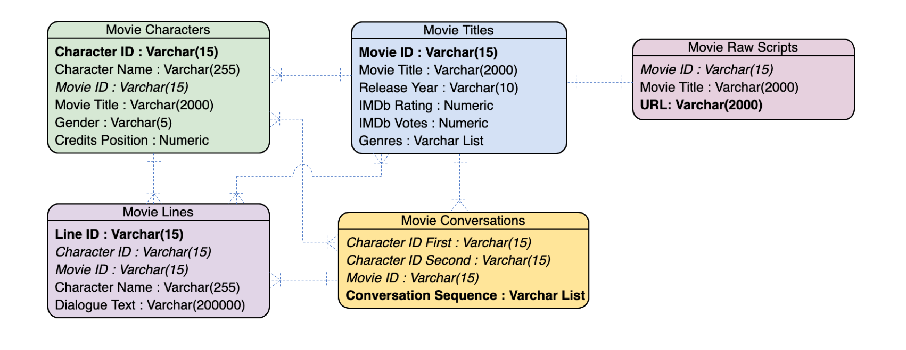

### Introduction

Effective dialogue between movie characters is one of the most important tools a filmmaker has to communicate the vision of their movie, move the plot forward, and engage the audience. Analyzing conversations between different movie characters can uncover the quantitative and qualitative differences between dialogues across different films and also uncover any forms of bias (like gender bias) that may exist in these conversations.

### The Data

The data set has been been extracted by the Cornell Movie - Dialogs Corpus that contains 220,579 conversational exchanges between 9,035 characters from 617 movies. In total, there are 304,713 dialogues taken from raw movie scripts. The entire data set is available in Kaggle's website and can be accessed through this [link](https://www.kaggle.com/rajathmc/cornell-moviedialog-corpus).

The data has been systematically organized into five different tables in CSV format. Their contents are described below:

* _MovieTitles.csv_: Information about each movie title uniquely identified by the Movie ID column

* _MovieCharacters.csv_: All movie characters uniquely identified by the Character ID column

* _MovieLines.csv_: The actual text of each dialogue spoken uniquely identified by the Line ID column

* _MovieConversations.csv_: The structure of all conversations uniquely identified by the Character ID of the first character in the conversation, Character ID of the second character, and the Movie ID column

* _MovieRawScriptURL.csv_: The uniform resource locator (URL) of all the raw scripts

### Repository Structure

The folders in the repository are organized as follows:

* _communication-in-films_: Root folder
  + _Dialogues.mb_: The Markdown file for this project
  + _Data_
    + _MovieTitles.csv_
    + _MovieCharacters.csv_
    + _MovieLines.csv_
    + _MovieConversations.csv_
    + _MovieRawScriptURLs.csv_

#### Entity Relationship Diagram

The tables are related in the following manner:



### Coding standards

* Entities like variables and functions have been named using camel case convention
* Local variables have been prefixed using 'v'
* Tables have been prefixed using 'tab'

### Data Cleaning (Pre-load)

The following steps were performed on the _MovieLines.csv_ file when cleaning the data:
* The default delimiter from the data source was this combination of characters: ' +++$+++ '. This has been changed to the pipe character '|'.
* Column five in _MovieLines.csv_ has spurious pipe characters which will interfere with the data loading step. Those have been deleted without a loss of valuable data.
* There is one spurious caret character '^' as a number separator. That has been removed without interfering with the number.
* To express emphasis on certain words, certain HTML tags have been used (like '\<i\> ... \</i\>','\<u\> ... \</u\>', '\<b\> ... \</b\>', '\<html\> ... \</html\>, '\<pre\> ... \</pre\>'), which can interfere with our analysis. Those have been removed as that information is not relevant to our analysis.

Once these steps are completed, we are left with 303,249 lines of dialogues.

### Importing Packages

The following packages will need to be imported for the analysis:

```python
import pandas as pd
```

### Importing the Data

Run the following scripts to import the data from your repository and check the dimensions of each table to makes sure the complete set has been loaded.

__Movie Titles__

```python
tabMovieTitles = pd.read_csv(file="Data/MovieTitles.csv", sep="|", encoding="ISO-8859-1", header=None, names=["Movie ID", "Movie Title", "Year", "IMDb Rating", "IMDb Votes", "Genres"])
```

Setting primary key
```python
tabMovieTitles.set_index("Movie ID")
```

Table shape
```python
print(tabMovieTitles.shape)
```

Table columns
```python
print(tabMovieTitles.columns)
```

Table information
```python
print(tabMovieTitles.info())
```

__Movie Characters__

```python
tabMovieCharacters = pd.read_csv(file="Data/MovieCharacters.csv", sep="|", encoding="ISO-8859-1", header=None, names=["Character ID", "Character Name", "Movie ID", "Movie Title", "Gender", "Position"])
```

Setting primary key
```python
tabMovieCharacters.set_index("Character ID")
```

Table shape
```python
print(tabMovieCharacters.shape)
```

Table columns
```python
print(tabMovieCharacters.columns)
```

Table information
```python
print(tabMovieCharacters.info())
```

__Movie Lines__

```python
tabMovieLines = pd.read_csv(file="Data/MovieLines.csv", sep="|", encoding="ISO-8859-1", header=None, names=["Line ID", "Character ID", "Movie ID", "Character Name", "Dialogue"])
```

Setting primary key
```python
tabMovieLines.set_index("Line ID")
```

Table shape
```python
print(tabMovieLines.shape)
```

Table columns
```python
print(tabMovieLines.columns)
```

Table information
```python
print(tabMovieLines.info())
```

__Movie Conversations__

```python
tabMovieConversations = pd.read_csv(file="Data/MovieConversations.csv", encoding="ISO-8859-1", sep="|", header=None, names=["Character ID", "First Character", "ID Second", "Movie ID", "Conversation"])
```

Setting primary key
```python
tabMovieConversations.set_index("Conversation")
```

Table shape
```python
print(tabMovieConversations.shape)
```

Table columns
```python
print(tabMovieConversations.columns)
```

Table information
```python
print(tabMovieConversations.info())
```

__Movie Raw Script URLs__

```python
tabMovieRawScriptURLs = pd.read_csv(file="Data/MovieRawScriptURLs.csv", encoding="ISO-8859-1", sep="|", header=None, names=["Movie ID", "Movie Title", "Raw Script URL"])
```

Setting primary key
```python
tabMovieRawScriptURLs.set_index("Raw Script URL")
```

Table shape
```python
print(tabMovieConversations.shape)
```

### Data Cleaning (Post-load)

* _tabMovieTitles_ has certain years that are appended with '/I' characters at the end. These have been trimmed and the year column has been converted to date-time format

Trimming trailing characters
```python
tabMovieTitles['Year'] = tabMovieTitles['Year'].map(lambda x: x.rstrip('/I'))
```

Converting column to date-time format
```python
tabMovieTitles['Year'] = pd.to_datetime(tabMovieTitles['Year'], format='%Y')
```
